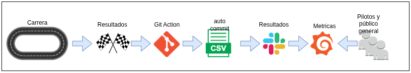
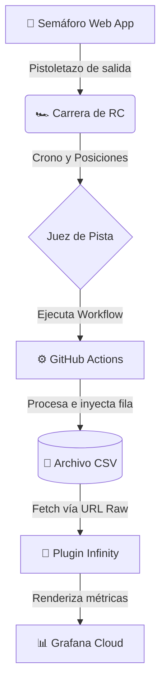
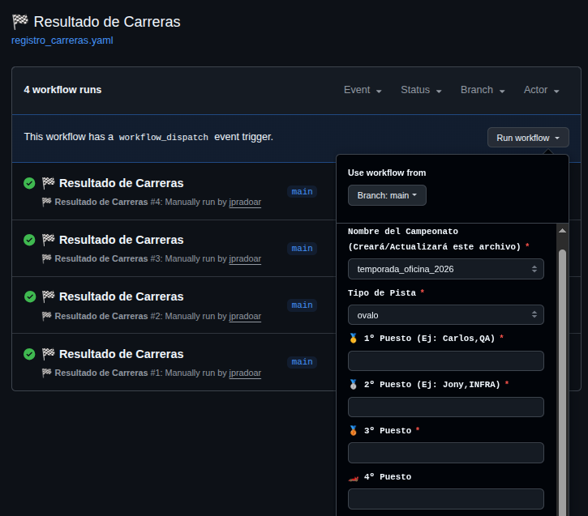
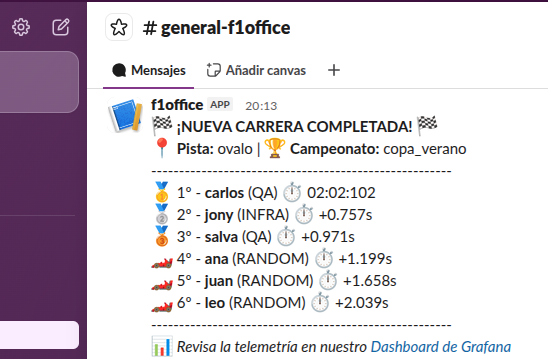
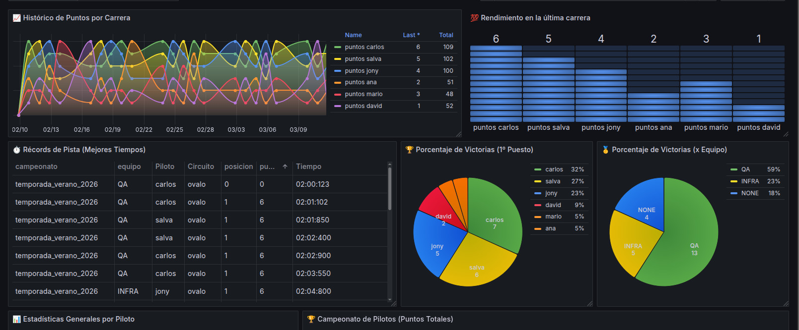
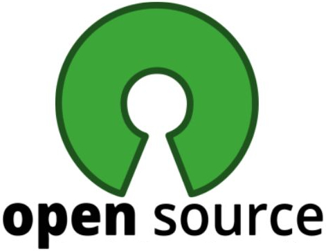
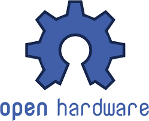

# 🏁 Gran Premio Oficina RC 1:64 🏎️💨
### Telemetry & Race Control 

¡Bienvenido al sistema de control de carrera y telemetría definitivo para las competiciones de autitos a radiocontrol (Escala 1:64) en la oficina! 

Más que un simple proyecto tecnológico, esta es una **iniciativa para fomentar el compañerismo, el *team building* y una sana competitividad entre las diferentes áreas de la empresa**. Es la excusa perfecta para desconectar unos minutos de las pantallas, compartir risas entre departamentos y llevar las típicas carreras de escritorio al siguiente nivel, integrando un semáforo de salida profesional estilo Fórmula 1 y un panel de estadísticas en tiempo real.

Además, es también la oportunidad de compartir con otros el mundo del Código Abierto, fomentando que no solo podemos jugar y hackear autitos, sino compartir mods de dashboards de Grafana y explorar más tecnologías.

---

## 🎯 Objetivos del Proyecto
1. **Team Building:** Romper el hielo entre departamentos y crear un espacio de interacción divertida y sana competencia en el lugar de trabajo.
2. **Infraestructura Serverless:** Proveer un sistema gratuito y altamente disponible para dar salidas de carrera justas y sincronizadas con alertas visuales y sonoras.
3. **Automatización:** Registrar los resultados y tiempos de cada Gran Premio de forma segura mediante flujos de trabajo en la nube.
4. **Transparencia y Emoción:** Visualizar la clasificación general, estadísticas de victorias y récords de pista en un Dashboard público accesible para toda la oficina.

---

## 🦾 Workflow CD/CD

   

---

## 🏎️ Los coches

  

  <b>Nota:</b>
Usamos esta escala por que es pequeña, practica y sobre todo económica. Cualquiera que quiera participar es bienvenido. Y lo más importante, <b>usamos esa escala por que son muy hackeables</b> y fáciles para hacer "MODS". (alivianado, modificación de chasis, cambio de batería (3,7V) por una de más mAh, etc).

---

## 🔗 Enlaces Rápidos

* 🚦 **[App del Semáforo de Carrera y Cronómetro](https://jpradoar.github.io/f1office/)**
* 📊 **[Dashboard de Telemetría en vivo (Grafana)](https://jpradoar.grafana.net/public-dashboards/4b359d53cd6c465b93d9f324ea53790a)**
* 📜 **[Reglamento](https://jpradoar.github.io/f1office/reglas.html)**
*   **[Credencial de Piloto](https://jpradoar.github.io/f1office/credencial.html)**

---

## 🏗️ Arquitectura del Sistema

El sistema está diseñado bajo una filosofía de "Data Engineering" ligera, aplicando el "Principio KISS" como principio fundamental y usando herramientas modernas para evitar el uso de bases de datos complejas y mantenimiento de sistemas y/o servers.  <b>(...y como siempre todo Open Source)</b>

---

## 💻 Tecnologias y Diseño (Principio KISS)

### Github Dispatch (manual trigger)

   

  

### Mensaje a slack (para generar la polémica)

   

  

### Grafana Dashboard para ver las metricas

   
  Grafana cloud para no tener que adminsitrar nada

---

## 🔧 La Cultura del Garaje (Mods, Hacks y Límites)

  
   

Fomentamos el espíritu del Código Abierto llevado al hardware. Se permite (¡y se anima!) a modificar los vehículos para ganar décimas de segundo, pero para mantener la igualdad económica y la seguridad, establecemos minimas **[REGLAS](https://jpradoar.github.io/f1office/reglas.html)**.
  
